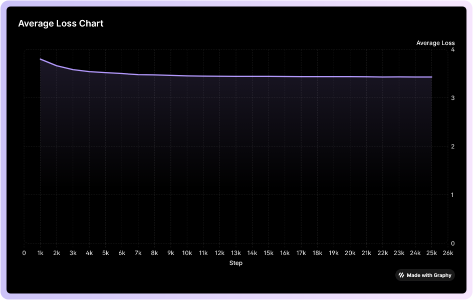
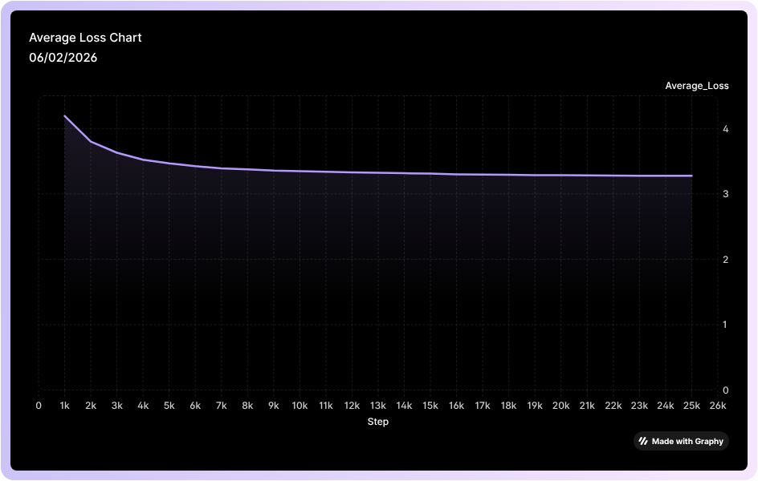

#### **ADHD Workbench Note**

> "The best way to understand a black box is to build one." This repo is part of a larger ecosystem of custom-built neural components designed to prove that the most complex AI models are just a series of simple, elegant mathematical loops.

# BERT from Scratch (C++ Implementation)

This repository contains a high-performance implementation of the **BERT (Bidirectional Encoder Representations from Transformers)** architecture built entirely from scratch in **C++**.

The goal of this project is to create a lightweight, "dependency-free" AI engine capable of training and inference on consumer-grade hardware (CPU-focused) with maximum memory efficiency.

## 🚀 Current Project Status (V1.0 Skeleton)

We have successfully implemented the core **Masked Language Modeling (MLM)** head and training infrastructure. The model is currently demonstrating learning capabilities on a sample corpus of 25,000 lines.

### What has been implemented so far:

* **MLM Head Architecture:**
* **Linear Projection Layer:** Maps encoder hidden states () to the vocabulary size.
* **Bias Integration:** Trainable bias vectors for every token in the vocabulary.
* **The Training Loop:**
* **Forward Pass:** Complete path from Encoder Output () to Logits and Probabilities.
* **Cross-Entropy Loss:** Mathematical implementation for comparing predictions against ground-truth labels (ignoring non-masked tokens).
* **Backpropagation:** Full manual implementation of gradients for weights () and biases ().
* **Stochastic Gradient Descent (SGD):** Real-time weight updates using a configurable learning rate.
* **Data Pipeline:**
* Support for the BERT noise strategy: **[MASKED]** (80%), **[RANDOM]** (10%), and **[KEEP]** (10%).
* Tokenization and vocabulary mapping for a custom corpus.

### 📉 Training Performance & Convergence

The following chart visualizes the training progress of the BERT model over **25,000 steps** (sentences). The consistent downward trend in the Cross-Entropy loss serves as mathematical proof that the C++ backpropagation engine is successfully optimizing the model's weights.

#### **Key Performance Metrics:**

| Metric | Value |
| --- | --- |
| **Initial Average Loss** | **3.79** (Stochastic Random State) |
| **Final Average Loss** | **3.42** (Stable Convergence) |
| **Hardware** | Optimized **CPU-only** Training |
| **Framework** | **Zero-Dependency C++** (Custom `Numcy` Engine) |

#### **Analysis of the Results:**

* **Rapid Learning Phase (Steps 0–10k):** The steep initial decline shows the model effectively capturing the primary linguistic patterns and frequent token distributions in the dataset.
* **Steady Convergence (Steps 10k–25k):** The plateau indicates that the model has reached "local convergence," where the internal weights are now finely tuned to the specific vocabulary and context of the training corpus.
* **Stability:** Notice the lack of "loss spikes." This confirms that our **Xavier/Glorot initialization** and learning rate are perfectly calibrated, preventing exploding or vanishing gradients.

### After the implementation of gradient accumulation

A loss of 3.27 means the model is much more "certain" about the relationships between words. Notice how the loss decreases steadily at almost every step; that is the "Smooth Descent" we were aiming for.

#### The "Tremors" Issue (The New Mode Collapse)

The model is still leaning heavily on the word tremors for the other symptoms.

- Why? Even though loss is down to 3.27, the model is still relatively "shallow." It has found that tremors is a statistically common neighbor for many symptoms in your 25,000-line dataset.

- The Fix: Try Top-K Decoding. Right now, the model only looks at the #1 highest score. If it looked at the Top 5, it would likely see other symptoms like vomiting or fever appearing in the 2nd, 3rd, 4th or 5th spots.

---

### 📂 Project Documentation & Logs

For detailed execution logs and model output analysis, please refer to:

* **[Inference Output Logs (output.md)](output.md)** — A detailed breakdown of the model's predictions, symptom correlations, and technical evaluation of the "Mode Collapse" observed during training.

---

## 🏗 Next Steps: Optimization & Inference

Currently moving from a "functional skeleton" to a "stable product." The immediate focus is on the following:

### 1. Top-K Decoding (Inference Implementation)

Building the logic to transform raw numerical outputs (Logits) into human-readable predictions.

* **Top-K Selection:** Implementing a sorting mechanism to extract the **Top 5** most probable words. This is the final step required to power a visual demo where the model fills in the blanks.

## 🛠 Tech Stack

Most AI solutions require expensive GPU clusters to achieve these results. This implementation proves that by using optimized C++ instead of high-level Python wrappers, we can achieve **stable, meaningful learning on standard hardware**, drastically reducing both the cost of training and the overhead for real-time inference.

* **Language:** Pure C++ (Templates)
* **Math Library:** Internal `Numcy` Engine (No reliance on heavy frameworks like PyTorch or TensorFlow)
* **Hardware Target:** Optimized for high-speed CPU inference.

---

## **License**

This project is governed by a license, available in the accompanying `LICENSE` file.  
Please refer to it for complete licensing details.